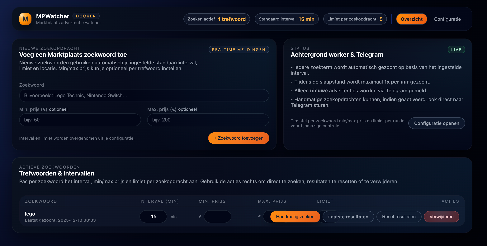

# MPWatcher – Marktplaats Advertentie Watcher

MPWatcher is een Docker-based webapplicatie waarmee je automatisch Marktplaats-advertenties monitort op basis van zoekwoorden en **direct via Telegram meldingen ontvangt** bij nieuwe advertenties.

✅ Webinterface  
✅ Telegram notificaties  
✅ Per zoekwoord instelbaar  
✅ Docker / Portainer / NAS-proof  
✅ Persistente configuratie via volume  

---

## 🚀 Functionaliteit

- Monitor meerdere zoekwoorden op **Marktplaats.nl** of **2dehands.be**  
- Alleen **nieuwe advertenties** worden gemeld  
- Optioneel een melding bij een **prijsverlaging** van een bekende advertentie  
- **Titelfilters** per zoekwoord: uitsluitwoorden (bijv. *gezocht*) en verplichte woorden  
- Veel nieuwe advertenties tegelijk? Dan één **samenvattend bericht** i.p.v. losse meldingen  
- Telegram berichten bevatten:
  - Titel
  - Prijs
  - Afbeelding
  - Button met link naar advertentie
- Instelbaar:
  - Zoekinterval  
  - Min. / max. prijs per zoekwoord  
  - Resultaatlimiet per zoekopdracht  
  - Postcode en straal  
  - Nachtmodus (slaapstand)  
  - Blocklist voor verkopers  
- Handmatige zoekactie mogelijk via de GUI  

---

## 📸 Screenshot



---

## 🐳 Installatie (Docker)

MPWatcher is bedoeld om te draaien als Docker container en werkt uitstekend met Portainer en andere Docker-omgevingen.

De container gebruikt één volume voor persistente data:

- `/config` – instellingen, zoekwoorden en resultaten  

Na het starten is de webinterface bereikbaar via de ingestelde poort.


```yaml
services:
  mpwatcher:
    image: ghcr.io/terrorsource/mpwatcher:latest
    container_name: mpwatcher
    restart: unless-stopped
    network_mode: bridge
    environment:
      - TZ=Europe/Amsterdam
    ports:
      - "8000:8000"
    volumes:
      - /path/to/mpwatcher-config:/config
    logging:
      driver: json-file
      options:
        max-size: "10m"
        max-file: "3"
```

> ℹ️ Het image staat op GitHub Container Registry en is beschikbaar voor
> **amd64 en arm64** (dus ook Raspberry Pi). Het oude Docker Hub-image
> (`makooy/mpwatchter`) wordt niet meer bijgewerkt — stap over op
> `ghcr.io/terrorsource/mpwatcher`. Naast `:latest` is per release ook een
> versie-tag beschikbaar (bijv. `:v19`).

De container heeft een ingebouwde healthcheck op `/health` die ook de interne
scheduler bewaakt: blijft die hangen, dan wordt de container unhealthy gemeld
en kan Docker/Portainer hem automatisch herstarten.

**Goed om te weten:**

- De container draait als non-root gebruiker (uid `1000`). Zorg dat de
  host-map die je aan `/config` koppelt schrijfbaar is voor uid 1000.
- Instellingen en zoekwoorden staan in `results.db` (SQLite). Bestaande
  `settings.json` / `keywords.json` uit oudere versies worden bij de eerste
  start automatisch geïmporteerd en hernoemd naar `*.imported`.
- Per zoekwoord worden maximaal 500 resultaten bewaard; oudere worden
  automatisch opgeruimd.
- Dezelfde advertentie die op meerdere zoekwoorden matcht wordt maar één
  keer via Telegram gemeld.
- De draaiende versie staat onderaan elke pagina en in `/health`.

---

## ⚙️ Configuratie via Web-GUI

Ga in de webinterface naar **Configuratie**.

### 🔁 Zoekinstellingen

- **Marketplace**  
  Marktplaats.nl of 2dehands.be  
- **Standaard interval (minuten)**  
  Wordt gebruikt voor nieuwe zoekwoorden  
- **Limiet per zoekopdracht**  
  Maximaal aantal advertenties per run (1–20)

### 🌙 Slaapstand (nachtmodus)

- Minder vaak zoeken tijdens de nacht  
- Standaard actief tussen **23:00 – 07:00**  
- Maximaal **1 zoekactie per uur** tijdens slaapstand  

### 📍 Locatie-instellingen

- **Postcode** (bijv. `1234AB`)  
- **Straal**
  - 3, 5, 10, 15, 25, 50, 75 km  
  - of *alle afstanden*

---

## 📲 Telegram configuratie

Vul de Telegram gegevens in onder **Configuratie → Telegram**:

- Telegram Bot Token  
- Telegram Chat ID  
- **Melding bij prijsverlaging** (aan/uit) — stuurt een 📉-melding wanneer
  een al bekende advertentie in prijs zakt  
- **Samenvatting vanaf** — vindt één zoekactie minstens dit aantal nieuwe
  advertenties, dan krijg je één overzichtsbericht in plaats van losse
  meldingen (0 = altijd losse meldingen)  

Meldingen bevatten titel, prijs, plaats van de verkoper, foto en een knop naar
de advertentie. Bij een tijdelijke Telegram-limiet (te veel berichten) wacht
MPWatcher automatisch en probeert het opnieuw.

Gebruik de knop **“Test Telegram”** om te controleren of alles werkt.

---

## 🚫 Blocklist verkopers

Onder **Configuratie → Blocklist verkopers** kun je verkopers uitsluiten
(één naam per regel). Advertenties van deze verkopers worden genegeerd en
dus ook niet via Telegram gemeld.

Op de resultatenpagina van een zoekwoord staat per advertentie een
**Blokkeer**-knop om de verkoper direct aan de blocklist toe te voegen
(de blocklist wordt daarbij automatisch ingeschakeld).

---

## 🔍 Zoekwoorden beheren

Via het **Overzicht** in de GUI:

- Voeg nieuwe zoekwoorden toe — de eerste zoekactie draait direct en slaat
  de bestaande advertenties **stil** op (geen Telegram-burst van oude ads)  
- Stel per zoekwoord in (wijzigingen worden direct opgeslagen):
  - Zoekterm  
  - Interval  
  - Min. / max. prijs  
  - Limiet per zoekopdracht  
  - **Uitsluitwoorden** — advertenties met één van deze woorden in de titel
    worden genegeerd (bijv. `gezocht, gevraagd` om vraag-advertenties weg te filteren)  
  - **Moet bevatten** — minstens één van deze woorden moet in de titel staan
    (bijv. `startbewijs, ticket`)  
- Per zoekwoord zie je wanneer er voor het laatst is gezocht, wanneer de
  volgende zoekactie komt, en of de laatste zoekactie een fout gaf  
- Beschikbare acties:
  - Handmatig zoeken  
  - Laatste resultaten bekijken (met foto en plaats)  
  - Resultaten resetten (met bevestiging; de volgende run is weer stil)  
  - Zoekwoord verwijderen (met bevestiging)  

✅ Alleen **nieuwe advertenties** worden doorgestuurd  
✅ Duplicaten worden automatisch gefilterd  

> ℹ️ Stel je een min- of maxprijs in, dan vallen advertenties zonder
> bruikbare prijs (zoals *Bieden* of *Gratis*) buiten de resultaten.

---

## 🧪 Handmatig zoeken

- Start direct een zoekactie via de GUI  
- Resultaten verschijnen:
  - in de webinterface  
  - optioneel direct via Telegram  

Handig om nieuwe instellingen te testen.

---

## 🛠️ Ontwikkelen & tests

```bash
pip install -r requirements-dev.txt
pytest
```

Lokaal draaien zonder Docker kan met `python app.py`; zet eventueel
`MPWATCHER_CONFIG_DIR` naar een lokale map (standaard `/config`).

De GitHub Actions-workflow draait eerst de tests (ook op pull requests) en
bouwt pas daarna het image; een kapotte build kan zo nooit als `:latest`
op je NAS belanden.

**Dependabot**: de wekelijkse PR's zijn een signaleringslijst. De versiemap in
de werkmap is de bron van waarheid en het publiceer-script overschrijft
GitHub — merge Dependabot-PR's dus niet op GitHub, maar neem de bumps over in
de volgende versie en sluit de PR's daarna.
