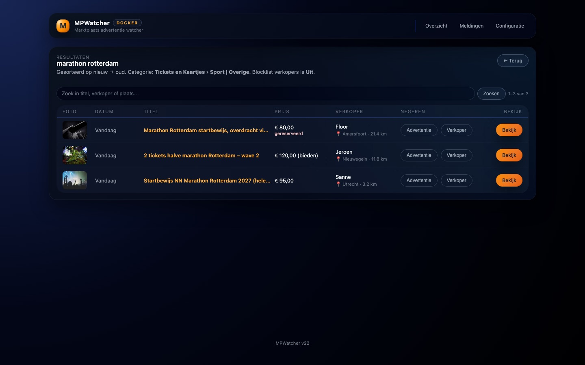

# MPWatcher – Marktplaats Advertentie Watcher

MPWatcher is een Docker-based webapplicatie waarmee je automatisch Marktplaats-advertenties monitort op basis van zoekwoorden en **direct via Telegram meldingen ontvangt** bij nieuwe advertenties.

✅ Webinterface  
✅ Telegram notificaties  
✅ Per zoekwoord instelbaar  
✅ Docker / Portainer / NAS-proof  
✅ Persistente configuratie via volume  

---

## 🚀 Functionaliteit

- Monitor meerdere zoekwoorden op **Marktplaats.nl** of **2dehands.be**  
- Alleen **nieuwe advertenties** worden gemeld  
- Optioneel een melding bij een **prijsverlaging** van een bekende advertentie  
- **Titelfilters** per zoekwoord: uitsluitwoorden (bijv. *gezocht*) en verplichte woorden  
- **Categoriefilter** per zoekwoord (bijv. alleen *Tickets en Kaartjes*)  
- **Advertenties negeren** op titel, naast het blokkeren van verkopers  
- **Herplaatsingen** (zelfde advertentie opnieuw geplaatst) worden niet nogmaals gemeld  
- **Verlopen advertenties** worden dagelijks gedetecteerd en gemarkeerd  
- **Kenmerkfilter** (conditie, maat, …) en **marketplace** per zoekwoord  
- Telegram naar **meerdere ontvangers**, ook per zoekwoord instelbaar  
- Markering van wat **nieuw is sinds je laatste bezoek**  
- Meldingen met plaats, afstand, kenmerken (conditie, maat) en een stukje omschrijving  
- Veel nieuwe advertenties tegelijk? Dan één **samenvattend bericht** i.p.v. losse meldingen  
- Overzicht met de **laatste nieuwe advertenties** over alle zoekwoorden heen  
- **Meldingenlogboek**: wat is gemeld, wat is onderdrukt en waarom  
- Gereserveerde advertenties herkenbaar (of overslaan); afstand bij een ingestelde postcode  
- Automatische **backoff** als de marketplace tijdelijk weigert  
- Telegram berichten bevatten:
  - Titel
  - Prijs
  - Afbeelding
  - Button met link naar advertentie
- Instelbaar:
  - Zoekinterval  
  - Min. / max. prijs per zoekwoord  
  - Resultaatlimiet per zoekopdracht  
  - Postcode en straal  
  - Nachtmodus (slaapstand)  
  - Blocklist voor verkopers  
- Handmatige zoekactie mogelijk via de GUI  

---

## 📸 Screenshots

Overzicht met statuskaart, recent gevonden advertenties en de zoekwoorden:


Resultaten per zoekwoord, doorzoekbaar, met foto, plaats/afstand en de knoppen
om een advertentie of verkoper te negeren:



*(demo-data)*

---

## 🐳 Installatie (Docker)

MPWatcher is bedoeld om te draaien als Docker container en werkt uitstekend met Portainer en andere Docker-omgevingen.

De container gebruikt één volume voor persistente data:

- `/config` – instellingen, zoekwoorden en resultaten  

Na het starten is de webinterface bereikbaar via de ingestelde poort.


```yaml
services:
  mpwatcher:
    image: ghcr.io/terrorsource/mpwatcher:latest
    container_name: mpwatcher
    restart: unless-stopped
    network_mode: bridge
    environment:
      - TZ=Europe/Amsterdam
    ports:
      - "8000:8000"
    volumes:
      - /path/to/mpwatcher-config:/config
    # Hardening (optioneel maar aanbevolen): de app schrijft alleen in /config
    read_only: true
    tmpfs:
      - /tmp
    cap_drop:
      - ALL
    security_opt:
      - no-new-privileges:true
    logging:
      driver: json-file
      options:
        max-size: "10m"
        max-file: "3"
```

> ℹ️ Het image staat op GitHub Container Registry en is beschikbaar voor
> **amd64 en arm64** (dus ook Raspberry Pi). Het oude Docker Hub-image
> (`makooy/mpwatchter`) wordt niet meer bijgewerkt — stap over op
> `ghcr.io/terrorsource/mpwatcher`. Naast `:latest` is per release ook een
> versie-tag beschikbaar (bijv. `:v19`).

De container heeft een ingebouwde healthcheck op `/health` die ook de interne
scheduler bewaakt: blijft die hangen, dan wordt de container unhealthy gemeld
en kan Docker/Portainer hem automatisch herstarten.

**Goed om te weten:**

- De container draait als non-root gebruiker (uid `1000`). Zorg dat de
  host-map die je aan `/config` koppelt schrijfbaar is voor uid 1000.
- Instellingen en zoekwoorden staan in `results.db` (SQLite). Bestaande
  `settings.json` / `keywords.json` uit oudere versies worden bij de eerste
  start automatisch geïmporteerd en hernoemd naar `*.imported`.
- Per zoekwoord worden maximaal 500 resultaten bewaard; oudere worden
  automatisch opgeruimd.
- Dezelfde advertentie die op meerdere zoekwoorden matcht wordt maar één
  keer via Telegram gemeld.
- De draaiende versie staat onderaan elke pagina en in `/health`.
- Weigert de marketplace een zoekopdracht (bijv. HTTP 403/429), dan verdubbelt
  MPWatcher het interval van dat zoekwoord per mislukking (tot 6 uur) zodat
  een tijdelijke blokkade niet verlengd wordt. Na een geslaagde run is het
  interval weer normaal; het overzicht toont hoeveel pogingen er mislukten.
- De browser-identificatie richting de marketplace is instelbaar met de
  omgevingsvariabele `MPWATCHER_USER_AGENT` (bijv. als een nieuwere
  browserversie nodig blijkt).

---

## ⚙️ Configuratie via Web-GUI

Ga in de webinterface naar **Configuratie**.

### 🔁 Zoekinstellingen

- **Marketplace**  
  Marktplaats.nl of 2dehands.be  
- **Standaard interval (minuten)**  
  Wordt gebruikt voor nieuwe zoekwoorden  
- **Limiet per zoekopdracht**  
  Maximaal aantal advertenties per run (1–20)
- **Herplaatsingen negeren (dagen)**  
  Verkopers plaatsen advertenties vaak opnieuw (nieuw advertentie-id, zelfde
  inhoud). Dezelfde titel + verkoper + prijs binnen dit aantal dagen wordt
  niet nogmaals gemeld. `0` = uit.
- **Verlopen advertenties controleren (dagen)**  
  Advertenties uit deze periode worden één keer per dag gecontroleerd; is een
  advertentie van de marketplace verdwenen, dan krijgt ze het label
  *verlopen*. `0` = uit.
- **Gereserveerde advertenties**  
  Tonen en melden met een label (standaard), of volledig overslaan.

### 🌙 Slaapstand (nachtmodus)

- Minder vaak zoeken tijdens de nacht  
- Standaard actief tussen **23:00 – 07:00**  
- Maximaal **1 zoekactie per uur** tijdens slaapstand  

### 📍 Locatie-instellingen

- **Postcode** (bijv. `1234AB`)  
- **Straal**
  - 3, 5, 10, 15, 25, 50, 75 km  
  - of *alle afstanden*

---

## 📲 Telegram configuratie

Vul de Telegram gegevens in onder **Configuratie → Telegram**:

- Telegram Bot Token  
- Telegram Chat ID('s) — één of meer, komma-gescheiden; elk bericht gaat
  naar alle ontvangers. Per zoekwoord kun je in het overzicht (veld *chat*)
  een afwijkende ontvanger instellen, bijv. de tickets naar je partner en de
  fietsen naar jezelf.  
- **Melding bij prijsverlaging** (aan/uit) — stuurt een 📉-melding wanneer
  een al bekende advertentie in prijs zakt  
- **Samenvatting vanaf** — vindt één zoekactie minstens dit aantal nieuwe
  advertenties, dan krijg je één overzichtsbericht in plaats van losse
  meldingen (0 = altijd losse meldingen)  

Meldingen bevatten zoekwoord, titel, prijs, plaats van de verkoper (met
afstand als je een postcode hebt ingesteld), foto en een knop naar de
advertentie. Bij een tijdelijke Telegram-limiet (te veel berichten) wacht
MPWatcher automatisch en probeert het opnieuw.

Onder **Meldingen** in de navigatie staat het logboek: elke verstuurde melding
én elke onderdrukte (herplaatsing, al gemeld via een ander zoekwoord, stille
eerste run) met de reden — handig bij "waarom kreeg ik dit (niet)?".

Gebruik de knop **“Test Telegram”** om te controleren of alles werkt.

---

## 🚫 Blocklist verkopers

Onder **Configuratie → Blocklist verkopers** kun je verkopers uitsluiten
(één naam per regel; een lege lijst betekent uit). Advertenties van deze
verkopers worden genegeerd en dus ook niet via Telegram gemeld. De
verkopersnaam in de resultaten linkt naar het Marktplaats-profiel, zodat je
andere advertenties en beoordelingen kunt bekijken voordat je blokkeert.

Op de resultatenpagina van een zoekwoord staat per advertentie een knop
**Negeren → Verkoper** om de verkoper direct aan de blocklist toe te voegen
(de blocklist wordt daarbij automatisch ingeschakeld).

### Advertenties negeren op titel

Wil je niet de hele verkoper blokkeren maar één specifieke advertentie, gebruik
dan **Negeren → Advertentie**. De titel komt op de lijst *Genegeerde
advertenties* (Configuratie): advertenties met precies die titel worden niet
meer opgeslagen of gemeld — ook niet als de verkoper ze opnieuw plaatst — en
bestaande resultaten met die titel worden verwijderd. De lijst is ook
handmatig te bewerken (één titel per regel, hoofdletters maken niet uit).

---

## 🔍 Zoekwoorden beheren

Via het **Overzicht** in de GUI:

- Voeg nieuwe zoekwoorden toe — de eerste zoekactie draait direct en slaat
  de bestaande advertenties **stil** op (geen Telegram-burst van oude ads)  
- Stel per zoekwoord in (wijzigingen worden direct opgeslagen):
  - Zoekterm  
  - Interval  
  - Min. / max. prijs  
  - Limiet per zoekopdracht  
  - **Uitsluitwoorden** — advertenties met één van deze woorden in de titel
    worden genegeerd (bijv. `gezocht, gevraagd` om vraag-advertenties weg te filteren)  
  - **Moet bevatten** — minstens één van deze woorden moet in de titel staan
    (bijv. `startbewijs, ticket`)  
  - **Kenmerk moet bevatten** — minstens één van deze woorden moet in de
    kenmerken van de advertentie staan (bijv. `zo goed als nieuw, 58 cm`)  
  - **Chat** — eigen Telegram-ontvanger(s) voor dit zoekwoord  
  - **Site** — Marktplaats.nl of 2dehands.be voor dit zoekwoord  
  - **Categorie** — klik op 📂 bij het zoekwoord en kies uit de categorieën
    die de marketplace voor die zoekterm kent (met aantallen). Een
    hoofdcategorie filtert de marketplace zelf; een subcategorie past
    MPWatcher lokaal toe.  
- Per zoekwoord zie je wanneer er voor het laatst is gezocht, wanneer de
  volgende zoekactie komt, en of de laatste zoekactie een fout gaf  
- Beschikbare acties:
  - Handmatig zoeken  
  - Resultaten bekijken (met foto en plaats), doorzoekbaar op titel,
    verkoper of plaats, en te bladeren door de volledige historie;
    advertenties die zijn bijgekomen sinds je vorige bezoek zijn gemarkeerd  
  - Resultaten resetten (met bevestiging; de volgende run is weer stil)  
  - Zoekwoord verwijderen (met bevestiging)  

✅ Alleen **nieuwe advertenties** worden doorgestuurd  
✅ Duplicaten worden automatisch gefilterd  

> ℹ️ Stel je een min- of maxprijs in, dan vallen advertenties zonder
> bruikbare prijs (zoals *Bieden* of *Gratis*) buiten de resultaten.

---

## 🧪 Handmatig zoeken

- Start direct een zoekactie via de GUI  
- Resultaten verschijnen:
  - in de webinterface  
  - optioneel direct via Telegram  

Handig om nieuwe instellingen te testen.

---

## 🛠️ Ontwikkelen & tests

```bash
pip install -r requirements-dev.txt
ruff check .
pytest
```

Wijzigingen per versie staan in [CHANGELOG.md](CHANGELOG.md); de sectie van
een versie wordt bij een release als release-tekst gebruikt.

Lokaal draaien zonder Docker kan met `python app.py`; zet eventueel
`MPWATCHER_CONFIG_DIR` naar een lokale map (standaard `/config`).

De code staat in het package `mpwatcher/`:

| Module           | Inhoud                                                    |
|------------------|-----------------------------------------------------------|
| `config.py`      | constanten, paden, logger, default-instellingen           |
| `utils.py`       | formattering en titelfilters                              |
| `db.py`          | SQLite: migraties, instellingen, zoekwoorden, resultaten  |
| `marketplace.py` | API-client en parsing van advertenties en categorieën     |
| `notify.py`      | Telegram (met retry en samenvattingen)                    |
| `scheduler.py`   | zoeklogica per zoekwoord en de achtergrondworker          |
| `web.py`         | Flask-routes                                              |

`app.py` in de hoofdmap is alleen het entrypoint voor gunicorn.

De GitHub Actions-workflow draait eerst de tests (ook op pull requests) en
bouwt pas daarna het image; een kapotte build kan zo nooit als `:latest`
op je NAS belanden.

**Dependabot**: de wekelijkse PR's zijn een signaleringslijst. De versiemap in
de werkmap is de bron van waarheid en het publiceer-script overschrijft
GitHub — merge Dependabot-PR's dus niet op GitHub, maar neem de bumps over in
de volgende versie en sluit de PR's daarna.
